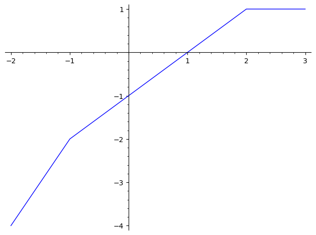
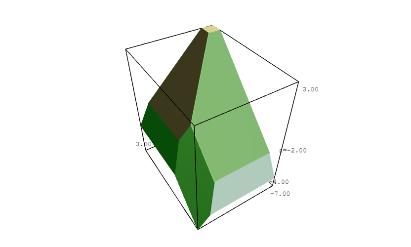

<head>
  <!-- Other head elements -->
  
</head>

# Final Report | GSoC 2024 @SageMath

## Overview
Google Summer of Code (GSoC) Project: [Implementation of Tropical Polynomials and its Corresponding Tropical Hypersurfaces](https://summerofcode.withgoogle.com/myprojects/details/j1yAryTd). 

A tropical polynomial is a polynomial whose coefficients come from a tropical semiring. Tropical polynomials define piecewise linear functions, which are often simpler to analyze compared to general non-linear functions. These polynomials form a commutative semiring, where operations are performed using (tropical)
addition and multiplication.

**A tropical hypersurface** is the set of points in $\mathbb{R}^n$ where the tropical polynomial function reaches its minimum (or maximum) value at least twice. In the univariate case, these points are referred to as tropical roots. For tropical polynomials in three or fewer variables, we can provide visualizations of these hypersurfaces, which give a clearer view of their geometric structure.

## Work Report

List of relevant issues and pull requests:
* [GSoC 2024: Meta-Ticket for implementing a tropical polynomials](https://github.com/sagemath/sage/issues/37962)
* [Implement a custom class for tropical polynomials](https://github.com/sagemath/sage/pull/38291)

### New class for Tropical Polynomials
Developed new element classes specifically designed to handle tropical polynomials, building on the existing tropical semiring implementation in SageMath. We've created a separate class for univariate and multivariate cases, along with a parent class that encapsulates the semiring structure. These classes support operations like (tropical) addition, multiplication, and exponentiation (with scalar).

### Graph of Univariate Tropical Polynomials
We developed and implemented an algorithm to find the tropical roots of univariate tropical polynomials. These roots allow us to determine the tropical polynomial function, which is essentially a piecewise linear function. Using these result, we can then plot the graph of the tropical polynomial. Here are a few examples of the graph:

| |   |
|:-:|:-:|
| Figure 1. Graph of $3x^3 + 1x^2 + 2x + 4$ (max-plus algebra) | Figure 2. Graph of $3x^3 + 1x^2 + 2x + 4$ (min-plus algebra)|

### Tropical Variety
A tropical variety is defined as the corner locus of a tropical polynomial function, consisting of all points in `\RR^n` where the minimum (or maximum) of the function is attained at least twice. We developed and implemented an algorithm to compute the tropical variety for any multivariate tropical polynomial, with the ability to visualize these varieties in the cases of two and three variables. For dimensions greater than three, the result is also referred to as a tropical hypersurface.

#### Tropical Curve
A tropical curve is a piecewise linear structure in `R^2` which can be seen as "tropical roots" of tropical polynomials in two variables.  For these polynomials, we can also plot their graphs, which consist of multiple surfaces in three dimensions. Some examples of these are:

|  |   |
|:-:|:-:|
|Figure 3. Tropical Curve of $-2x^2 + -1x + \frac{1}{2}y$| Figure 4. Graph of $-2x^2 + -1x + \frac{1}{2}y$ |

|  |   |
|:-:|:-:|
|Figure 5: Tropical Curve of $-2x^2 + -1x + \frac{1}{2}y$ | Figure 6: Graph of $-2x^2 + -1x + \frac{1}{2}y$ |

#### Tropical Surface
A tropical surface is a piecewise linear structure in `R^2` which can be seen as "tropical roots" of tropical polynomials in three variables.  The tropical surface consists of planar regions and facets, referred to as cells. Some examples of these are:

| |  |
|:-:|:-:|
|Figure 3. Tropical Surface of $x + y + z$|Figure 4. Tropical Surface of $-x^2 + xyz + x + y + z + 1$|

### Dual Subdivision
Dual subdivision is a subdivision of the Newton polygon of tropical polynomials. This subdivision is "dual" in the sense that each face of the subdivision corresponds to a vertex of the tropical curve, and each edge of the subdivision corresponds to an edge of the tropical curve. This analogy extends to tropical varieties in higher dimensions, where the dual subdivision similarly reflects the structure of the variety. Some examples of these are:

### Weight Vectors
As seen before, a tropical curve consists of line segments and half-lines, referred to as edges. These edges meet at a vertices, where the balancing condition is satisfied. This balancing condition ensures that the sum of the outgoing slopes at each vertex is zero, reflecting the equilibrium.

### Potential Future Improvements
* We have successfully implemented the concept of weight vectors for tropical curves and extended it to tropical surfaces. However, generalizing this concept to tropical varieties of dimension $n \geq 4$ remains open and requires further exploration
* Refactor polynomial classes for the semiring polynomials
* Extending the tropical polynomial semiring to Laurent polynomial ring

### Final Thoughts
TBA

